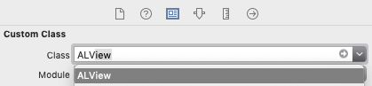

# ALayout [](https://github.com/Carthage/Carthage)

A dynamic framework that allows you to easily add shadows to a UIView instance, using the same shadow paramters in [Sketch](www.sketchapp.com).

Compatible with Swift 4.2 + and iOS 12.0 +.

<br/>

## Getting Started

### Prerequisites

Make sure you have Carthage installed. Otherwise, simply install with Homebrew:

```bash
brew install carthage
```

<br/>
<br/>

### Include it to your iOS Project

1. At the directory of your `.xcodeproj` or `.xcworkspace` file, create a file named `Cartfile`. Open the file using your text editor, add one line:

```
github "EdgarDegas/ALayout"
```

2. At the same directory, execute this line into your Terminal:

```
carthage update
```

3. When `update` is done, a new folder `Carthage` is created. Get into  `Carthage/Build/iOS`, find  `ALayout.framework`.
4. Open your xcode project, drag the `ALayout.framework` file into `Linked Frameworks and Libraries`.


<br/>
<br/>

## Quick tutorial

### Add Shadows to ALView

0. Import ALayout

```swift
import ALayout
```

<br/>

1. Initialize a  `Shadow` object:

```swift
let shadow = Shadow(color: opacity: dx: dy: blur: spread)
```

The parameters are basically the same with those in Sketch. In case you are not familiar with UI design:

* color: `UIColor`
* opacity: `CGFloat`, ranging from 0.0 (transparent) to 1.0 (opaque)
* dx: `CGFloat`, offset on x-axis, negative (leftward) or positive (rightward)
* dy: `CGFloat`, offset on x-axis, negative (upward) or positive (downward)
* blur: `CGFloat`, the blur radius of shadow, positive value
* spread: `CGFloat`, increase or decrese the size of shadow from the size of your view

<br/>

2. Make sure you view is a `ALView` instance. 

   * If you are using interface builder, select the view, and set it as a `ALView` instance from right panel.

   

   * If you initialize your view with code:

   ```swift
   let someView = ALView(frame: )
   ```


<br/>

3. Then add `shadow` to your `ALView` instance. You can do this in the `viewDidLoad()` function: 

```swift
import ALayout

class YourViewController: UIViewController {
    
    // MARK: - Life Cycle
    override func viewDidLoad() {
        super.viewDidLoad()
        
        // initialize and add the shadow to `someView`
        let shadow = Shadow(color: #colorLiteral(red: 0.6745098039, green: 0.8156862745, blue: 0.9921568627, alpha: 1), opacity: 0.12, dx: 0, dy: 6, blur: 16, spread: -6)
        _ = someView.add(shadow)
    }
}
```

Method `add` returns the  `ShadowLayer` instance to which the shadow is attached. Add `_ = ` to silence the warning.


>  If your view is created in IB, you may need to add this line:

```swift
someView.clipsToBounds = false
```

> The `add` method creates a `CALayer` instance and add it to sublayers of you view's layer.
>
> This shadow layer and its shadow have the same `cornerRadius` with your UIView instance.
>
> The shadow layer has the same `backgroundColor` with your UIView instance. If your view is translucent, the transparency will change.  

<br/>

4. You can add multiple shadows to one view. For example we add two shadows to `captionView`:

```swift
import ALayout

class YourViewController: UIViewController {
    
    // MARK: - Life Cycle
    override func viewDidLoad() {
        super.viewDidLoad()
        
        // initialize and add shadows to `someView`
        _ = captionView.add(shadow: Shadow(color: #colorLiteral(red: 0.6745098039, green: 0.8156862745, blue: 0.9921568627, alpha: 1), opacity: 0.24, dx: 0, dy: 6, blur: 12, spread: -6))
        _ = captionView.add(shadow: Shadow(color: #colorLiteral(red: 0.6745098039, green: 0.8156862745, blue: 0.9921568627, alpha: 1), opacity: 0.16, dx: 0, dy: 4, blur: 16, spread: -6))
    }
}

```

<br/>
<br/>

### Remove Shadows

By calling method `removeShadows` of ALView, you can move all shadows you have added to `someView`. All `ShadowLayer` instances is returned by this function.

```swift
_ = someView.removeShadows()
```


<br/>