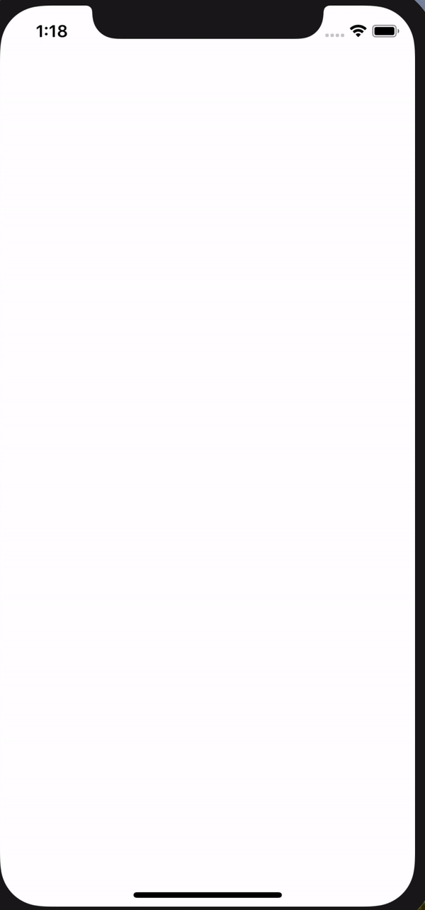
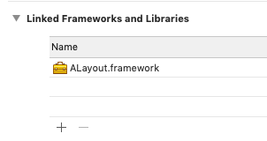
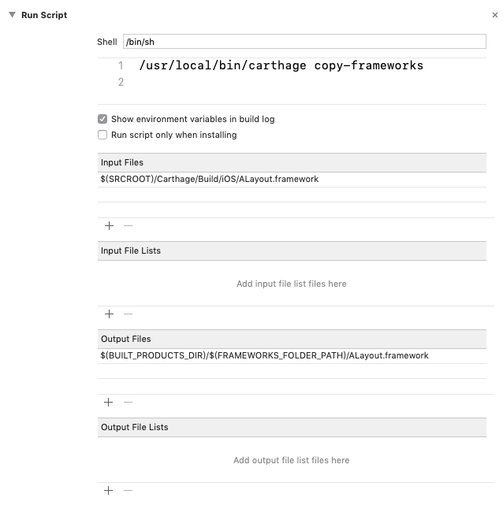

# ALayout 

[](https://github.com/Carthage/Carthage) [](https://travis-ci.com/EdgarDegas/ALayout)

A dynamic framework that allows you to easily add shadows to a UIView instance, using the same shadow paramters in [Sketch](www.sketchapp.com).

This framework even supports animations on showing / hiding or changing the shadow.

> This project is on a unstable beta stage. Think twice before using it on a business project.

Compatible with Swift 4.2 + and iOS 12.0 +.



<br/>

## Getting Started

### Prerequisites

Make sure you have Carthage installed. Otherwise, simply install with Homebrew:

```bash
brew install carthage
```

<br/>
<br/>

### Include it to your iOS Project

1. At the directory of your `.xcodeproj` or `.xcworkspace` file, create a file named `Cartfile`. Open the file using your text editor, add one line:

```
github "EdgarDegas/ALayout"
```

2. At the same directory, execute this line into your Terminal:

```
carthage update
```

3. When `update` is done, a new folder `Carthage` is created. 
   1. Go to your target's general setting page:
      
   2. Click +, select 「Add other...」, then go into  `Carthage/Build/iOS`, find  `ALayout.framework` and add it.

4. You need to add Run Script to at your build phases:

   

   Make sure the path in the `Input Files` section is correct.

<br/>
<br/>

## Quick tutorial

### Add Shadows to UIView

0. Import ALayout

```swift
import ALayout
```

<br/>

1. Initialize a  `Shadow` object:

```swift
Shadow(color:opacity:Offset:blur:spread:)
```

The parameters are basically the same with those in Sketch. In case you are not familiar with UI design:

* color: `ShadowColor`, UIColor` is OK. Or you can use  `ShadowRGBAColor`, `ShadowHexColor` for convenience color setup.
* opacity: `CGFloat`, ranging from 0.0 (transparent) to 1.0 (opaque)
* offset, a tuple containing two CGFloat values:
  * dx: `CGFloat`, offset on x-axis, negative (leftward) or positive (rightward)
  * dy: `CGFloat`, offset on x-axis, negative (upward) or positive (downward)
* blur: `CGFloat`, the blur radius of shadow, positive value
* spread: `CGFloat`, increase or decrese the size of shadow from the size of your view


Initializing example:

```swift
let myShadow = Shadow(color: UIColor.black, opacity: 1, offset: (dx: 0, dy: 0), blur: 24)
```


<br/>

2. Set shadow:

```swift
myView.set(shadow: myShadow, animated: true)
```


And if you set a different `Shadow` instance now, you would see the shadow changing animation.

```swift
myView.set(shadow: anotherShadow, aniamted: true)
```


> Somtimes you may need to specify `clipsToBounds` to `false`:

```swift
myView.clipsToBounds = false
```

<br/>


3. Remove shadow:

```swift
myView.removeShadow(animated: true)
```

<br/>


4. If your user interface needs layout, you should call this method at a proper timing:

```swift
myView.layoutShadow()
```


<br/>

## Under the Hood

By calling `set(shadow:)` on UIView instances, the framework inserts a CALayer with shadow at the bottom of the sublayers of the view's layer.